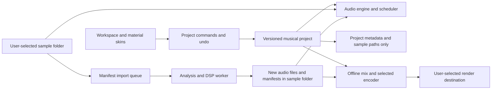

# RaveFold delivery plan

Date: 2026-09-22. This document is a recommended plan.
[PRODUCT.md](../PRODUCT.md) gives the requirements with user approval.
[Private research notes](research/local-research.md) show which statements are
source evidence and which are recommendations. Other items in this plan are
recommendations, not user approvals. Current source files and check results show
implementation status.

[The specification index](specs/spec-000-index.md) gives the product slices. A
product slice is a feature with its interface, logic, storage and acceptance
checks. Each specification gives the detailed behavior and checks for one slice.
This plan contains the architecture proposals, evidence targets and delivery
checkpoints. A checkpoint is a step at which combined features must pass their
checks.

The private research folder contains technology names, source links and asset
evidence. That folder is not part of public copies of this repository. Read the
private specification before you use its sources for decisions.

## 1. Product and first release

RaveFold uses samples to make rave music in a browser. A sample is an audio file
or a selected section of that file. A clip is a timed use of a sample on a
track. An arrangement gives the position and duration of each clip.

Use OG as the reference for a new interpretation of sample-based composition.
Matching all OG features is not a product goal. OG project compatibility is also
not a product goal. Add undo, sound search, background import, clear waveforms
and project files with sample-path references. A project file contains
arrangement data and paths, with no audio data.

The first-release task has user approval: arrange and export tracks. Users
import samples, edit clips and adjust a basic mix. They can save and reopen
projects, then export stereo WAV or MP3. Recording, sound synthesis and
automation are not part of the first release.

The first release supports editing on desktop and laptop computers with a
keyboard and pointer. The first release does not include full editing on tablets
or phones. The intended users want to make rave music quickly. They can include
persons who used OG. The other feature details below are recommendations.

OG is the reference for arrangement, sample import, audio recording and sound
generation. [Private research](research/local-research.md#original-product)
contains source descriptions and library measurements.

| First release                                                                                                      |
| ------------------------------------------------------------------------------------------------------------------ |
| Library search, folder browsing, editable tags, favorites, preview, waveforms and preparation status               |
| Eight initial tracks, with controls to add, remove and change their sequence. Recommended tested limit: 32 tracks. |
| Clip insertion by drag-and-drop or keyboard, movement, duplication, deletion, trim, repeat, undo and redo          |
| Play, pause, stop, seek, loop region, musical snap and timeline zoom                                               |
| Track gain, pan, mute, solo and meters. Master gain and clipping indication.                                       |
| Background import preparation, review and retry                                                                    |
| Project save and reopen, missing-sample indicators, stereo WAV or MP3 export and all six skins                     |

Do not add variable project tempo, a key selector, plug-in hosting or a full
piano-roll editor to this release. The fixed tempo and key are product features.

## 2. Musical contract

### Decisions with user approval

- The arrangement operates at **180 BPM in C minor**. BPM means beats per
  minute.
- Accept natural, harmonic and melodic minor as compatible forms of C minor.
  Keep uncertain key results in review.
- Rhythmic samples with **`ready` status** have a tempo of **90 or 180 BPM
  only**.
- Keep 90 BPM loops at their source speed by default. Four source beats occupy
  eight arrangement beats at 180 BPM.
- Convert **all other source tempos** before use. This includes 45, 135 and 270
  BPM. The initial rule gave different treatment to multiples of 45 BPM. The new
  decision replaces that rule.
- Complete the necessary time stretching and pitch shifting before you set
  `ready` status. Do this work in the background.
- Accept unpitched one-shots without tempo or key conversion. Keep their source
  sound and duration. Place their start on the arrangement grid.
- Treat unpitched drum and noise loops as key-neutral. Prepare them at 90 or 180
  BPM without pitch shifting. Apply the tonal rules to tuned percussion.
- Keep major and mixed-key imports in review. Use only compatible sections in
  the first release. A pitch shift of the full signal does not change its
  musical mode.

### Recommended behavior

Use 4/4 time. Use integer musical ticks at 960 ticks for each quarter note. A
tick is the smallest unit of musical time in the project. Set the initial snap
interval to one bar. Also give the user beat and sixteenth-note snap intervals.
Snap moves a clip position to the selected grid interval.

Calculate seconds from absolute ticks. Do not add rounded clip durations again
and again to calculate a position.

Keep 90 BPM loops at their natural speed as half-time audio. Four source beats
at 90 BPM occupy eight arrangement beats at 180 BPM. An eight-beat 180 BPM loop
occupies eight arrangement beats. A change of speed or pitch is not necessary
for these loops.

For a rhythmic import, recommend the target in `{90, 180}` with the smallest
value of `abs(log2(targetBpm / sourceBpm))`. If the values are equal, recommend
180 BPM. Let the user select the other supported target before conversion. Keep
the source beat count:

- `outputDuration = sourceDuration * sourceBpm / targetBpm`.
- `arrangementBeats = sourceBeats * 180 / targetBpm`.
- Set pitch and tempo independently.

| Source                           | Preparation                                                                         | Position at 180 BPM            |
| -------------------------------- | ----------------------------------------------------------------------------------- | ------------------------------ |
| 180 BPM, C minor, 4 source beats | Validate the sample. No musical conversion is necessary.                            | 4 arrangement beats            |
| 90 BPM, C minor, 4 source beats  | Validate the sample. Keep half-time playback.                                       | 8 arrangement beats            |
| 135 BPM, D minor, 4 source beats | Recommend 180 BPM. Shift the pitch down 2 semitones.                                | 4 arrangement beats            |
| 45 BPM, C minor, 4 source beats  | Recommend 90 BPM.                                                                   | 8 arrangement beats            |
| 270 BPM, C minor, 4 source beats | Recommend 180 BPM.                                                                  | 4 arrangement beats            |
| Major or mixed-key phrase        | Keep the phrase in review. Select a compatible section. Analyze that section again. | No placement before validation |

Metadata is information about an audio file, such as format, tempo or musical
key. Show uncertainty in detector results, especially the difference between 90
BPM and 180 BPM. A beat detector cannot know the intended tempo in all cases. A
key detector cannot prove that each note is compatible. Store source metadata,
measurements, confidence scores, manual corrections and prepared values
independently.

For tonal audio in a minor key, transpose to C with the nearest signed semitone
offset. Give the user a control for octave adjustment. Accept natural, harmonic
and melodic minor after transposition to C. Keep uncertain key results in
review. Keep the source audio. Do not set C-minor metadata only because
conversion is completed.

A one-shot is a sound for one playback, not a loop. Unpitched one-shots have
user approval for use without musical conversion. Do not invent a detected BPM
or musical key for them. File validation is necessary before `ready` status.
Detector uncertainty is a different decision.

Unpitched drum and noise loops are key-neutral, with no musical key. Prepare
them at 90 or 180 BPM. Do not apply pitch shifting to these loops. Tuned
percussion uses the tonal rules.

## 3. Workspace and interaction

Keep the user in the main menu until the two folder requirements pass. A valid
sample folder and a writable settings folder are necessary. Use a setup window
for folder selection. Cancellation, denied access or an invalid folder must keep
the menu and setup controls usable. Do not start the tracker or editor without a
valid folder.

Spec-001 gives the requirements for the full main menu before the tracker opens.
It includes New project, Open project, selection of available recovery copies,
folder settings and appearance. Complete all six material skins and their menu
states in that slice. A skin is a set of interface appearance settings. Spec-012
extends the same appearance system to tracker use and playback.

If the application loses access to the sample folder, return to folder setup.
Keep the project state for recovery. Missing files in a folder with access do
not prevent project loading or editing. Show a red bubble at each missing
sample's clip position in the tracker. Give each bubble a text label that
identifies the missing sample.

Use a composition workspace with fixed panels. The arranger is the primary panel
for clip positions. The library and inspector supply information for this panel.
Do not move panels during clip edits.

```text
RaveFold | Project / Save / Export | Transport | 180 BPM / C minor | Skin
------------------------------------------------------------------------
Library             | Bar ruler and loop region              | Inspector
Search and filters  | Track headers | Arranger grid          | Clip/sample
Sample rows         |               | Clips and waveforms    | properties
Preview and status  |               | Playhead               | Preparation
------------------------------------------------------------------------
Track mixer and master meter              | Import progress / storage state
```

Use folder browsing and editable tags for library organization. This choice has
user approval. Store tags in the sample-folder manifest. Tag edits do not rename
or move audio files. Let users filter tags across folders. Store source category
metadata independently of editable tags.

Keep the transport controls in view. These controls start, stop and position
playback. Show the sample name, tags, source tempo, prepared tempo, key status,
length and preparation status in the library. Give the inspector a waveform and
source-history details. Do not show internal processor details in usual
controls.

Show an insertion outline at the snap position on the selected track. Use one
active clip on each track in the first release. Reject overlaps with a clear
overlap indication. Let the user replace an existing clip only through a
replacement command that the user selects.

Give loop repetition and region trim different handles or modes. Use short fades
at boundaries where necessary. Do not move the musical onset. Do not hide
defective loop markers. The onset is the start of the sound.

Play only one preview at a time. A new preview stops the previous preview.
During playback, a loop with `ready` status can start its preview at the next
bar. The review inspector operates source preview independently of the
arrangement. This preview alone does not give a sample `ready` status.

Let the user select clips across tracks. Move, copy or delete the selected clips
as one command. Keep relative timing and track spacing when you move or copy the
group. Validate the full edit before you change the arrangement. An invalid
placement leaves each selected clip unchanged. One undo restores the state
before the group edit.

Use select-all and delete to remove all clips. Do not add a Clear arrangement
command. Keep tracks, mixer settings and sample files unchanged. Group undo
restores the deleted clips. Keep New project and clip deletion as different
commands.

Spec-001 gives the requirements for opening the main menu. Spec-009 gives the
behavior for unsaved changes when the user leaves or replaces an active tracker
project.

Give keyboard commands for transport, insertion, movement, duplication,
deletion, undo, redo and exit from an operation. Give controls clear focus
indicators and labels that support accessibility. Use color to identify sound
roles. Give labels and icons the same meaning as the colors. Announce import
results, but not each meter update.

At 1280 x 720, close the inspector panel before you decrease the arranger width.
At smaller widths, give the library, arranger and mixer different views. Phone
layouts can show the library and previews, but this is not a first-release
requirement. The first release does not include full editing on tablets or
phones. Do tests of 200% zoom, keyboard operation, contrast and focus in each
skin.

### Tooltips

Tooltips are the only form of product help with user approval. Do not add help
pages, command-reference panels, guided tours or tutorials. Do not supply demo
songs. Give each control an accessible name that is available without a tooltip.
Make tooltip text available on pointer hover and keyboard focus. Write the
dismissal and focus behavior in the interface specification.

### Six skins, one set of controls

Deliver the registry, appearance controls, settings storage and static fallback
with spec-001. The menu and application-owned dialogs must have the full
reference styling before tracker implementation. Spec-012 gives the requirements
for tracker integration and continuous playback. It does not include the first
theme implementation.

Use all six presets in the
[private technology specification](research/local-research.md#binding-technology-requirements).
The presets are entries in the reference demo configuration. The package does
not export them as preset objects. Make a typed registry from the fixed defaults
and each preset patch. Keep the necessary license notices with copied material.
The neutral descriptions below do not replace the preset definitions.

| Skin        | Appearance                                             |
| ----------- | ------------------------------------------------------ |
| Reference 1 | Transparent surfaces and edges with colors that change |
| Reference 2 | Dark frosted surfaces. Recommended initial selection.  |
| Reference 3 | Surfaces that are not transparent, with fewer effects  |
| Reference 4 | Transparent surfaces with refraction                   |
| Reference 5 | Pink edges and dark colors                             |
| Reference 6 | Large movements and ambient effects                    |

Keep the layout, sound-role colors, focus indication and commands the same in
all skins. Use text backgrounds that are not transparent, or give sufficient
contrast above the material. Give waveforms sufficient contrast too. Save the
skin selection as a user preference. Do not put it in project audio data.

A material surface uses visual effects, such as blur and refraction.

Use the material library on approximately five to eight primary panels. Do not
use a material surface for each clip, row, meter or waveform segment. The
documented default limit is 16 surfaces. Keep scrolling in panels. Use semantic
DOM dialogs with simple backgrounds unless measurements show that a second WebGL
render pass is permitted. [Private source evidence](research/local-research.md)
gives the library limits.

Give all six skins Full, Reduced and Static effects settings. Static uses the
same style tokens with CSS surfaces. Do not mount the material renderer in
Static mode. Select Static when the user prefers reduced motion. Let the user
change this selection through a control.

The library continues its animation in reduced-motion mode. The `canvas={false}`
setting changes canvas placement only. The two settings do not stop the
renderer. A skin change must not make a new audio engine.
[Private source evidence](research/local-research.md) gives the renderer
behavior.

## 4. Technical design

Use the typed language, compiler major version 7, component framework and
material library from the private specification. The
[private technology specification](research/local-research.md#binding-technology-requirements)
also identifies the recommended build tool.

Use tested dependency versions with no version ranges in the lockfile. Use
public components and hooks. Do not use internal renderer interfaces. Before
dependency installation, examine the compatibility requirements in private
research.

Write project-owned UI, domain, audio, worker, test and tool source in `.ts` or
`.tsx`. Use strict type checking with `allowJs: false`. Use the fixed major-7
compiler for the type check. Build-time transpilation alone is not a type check.
Generated browser output and third-party DSP binaries are files for runtime use.

Give application, worker and tool source different compiler environments when
you add those files. Include each source group in strict compiler checks.



| Directory                | Function                                                                       |
| ------------------------ | ------------------------------------------------------------------------------ |
| `domain/`                | Pure project model, ticks, clip edits, command history and schema validation   |
| `audio/`                 | Audio graph, scheduling by absolute time, transport, preview and render graph  |
| `import/` and `workers/` | File checks, analysis, conversion, queue and cancellation                      |
| `storage/`               | Folder permissions, manifests, project paths, recovery and output destinations |
| `ui/` and `skins/`       | Component controls, virtualized library and timeline, and theme adapter        |
| `catalog/`               | Source manifest, categories, stereo pairs, corrections and source history      |

The first-release mixer has these controls with user approval: track volume,
pan, mute, solo, meters and master volume. Do not include reverb, delay, EQ or
distortion in this release. Effect samples are ordinary library audio. These
limits do not remove the sample-preparation process with user approval.

An audio voice plays one sample. An audio scheduler starts and stops voices at
specified times.

Start with Web Audio buffer sources and native gain and pan nodes. Use
`AudioContext.currentTime` as the scheduling clock. Measure an initial scheduler
interval of 25 ms and a look-ahead period of 200 ms. Do not use UI updates or
`requestAnimationFrame` to start notes.

For seek, pause, loop wrap or edits, cancel voices that no longer match the
arrangement. Schedule new voices from the selected musical position. Limit the
number of voices. Make gain changes smooth. The meter display can skip frames,
but audio playback must continue without interruptions.

Start or resume audio only after a user command. Show suspended audio contexts
and output-device changes clearly. For the first release, this plan recommends a
transport pause when the page becomes hidden. Save the transport position at
that time. Continue playback only after a user command. Do not promise
continuous background playback.

Use an AudioWorklet scheduler only if measurements show that it is necessary for
prepared samples. [Private source evidence](research/local-research.md) gives
the audio API behavior.

Use a Worker and a WASM DSP kernel for sample preparation. A Worker runs code
independently of the main browser thread. WASM means WebAssembly, a binary
format for code that runs in a browser. DSP means digital signal processing.

First, do a test of the candidate in
[private research](research/local-research.md#browser-audio-and-storage-evidence).
It changes duration and pitch independently.

Before package selection, do a test of its offline interface in a Worker. Also
do tests of latency and audio tails. Latency is the interval between input and
output. A tail is the sound that continues after the primary sound ends. Write
an adapter only after these tests show the necessary interface.

A web wrapper alone does not prove Worker compatibility. Keep the applicable
license obligations.

Do not use `AudioBufferSourceNode.playbackRate` for time stretching that must
keep the pitch constant. That property resamples the source and changes speed
and pitch together. Use playback rate 1 for usual playback of prepared samples.
This plan recommends a single-threaded WASM build with transferable buffers.
SharedArrayBuffer and special isolation headers are then not necessary for the
minimum supported system. [Private source evidence](research/local-research.md)
gives the playback behavior.

## 5. Import and catalog process

Make the library manifest again from file headers and loop boundaries with
approval. A manifest is a file that contains sample metadata and processing
state. Keep the source metadata unchanged as source history. Resolve catalog
differences, unusual boundaries and stereo pairs before a full library import.
Keep counts, filenames, methods and measurements in
[private research](research/local-research.md#supplied-sample-library).

Use the sample-source requirements in [PRODUCT.md](../PRODUCT.md) for setup.
Open a setup window for initial sample-folder selection. Start library discovery
only after the user selects a folder. Do not supply a sample pack. Do not offer
a demo sample download. The application uses the selected sample folder
exclusively for library audio.

Initial folder access is not possible without user selection and permission.
Keep the setup window usable after cancellation or denied access. If folder
selection is unavailable, give a clear capability message without an application
error. Keep the main menu usable when the editor cannot start.

Do a check of folder access before library operations. A valid sample folder has
read/write access and at least one supported audio file. Include files in
subfolders. Do not wait for all sample preparation before you open the main
view.

Add new samples and manifest files only in the selected sample folder. Manifests
contain sample metadata and processing state. The application can change or
delete manifests. It must not delete, overwrite, replace or truncate any
existing audio file. This protection includes source, prepared, partial and
unused audio files.

A local catalog command can read `OG_INSTALL_DIR` and `SAMPLES_DIR` from the
ignored `.env.local` during development.

Do not copy these values into client environment variables, logs, documents,
manifests, archives or browser output. Store only relative paths and source IDs
as source history. Do not put the full sample library in public assets or the
repository. Recover display names from the installed catalog for private local
use.

Account for catalog gaps and possible stereo pairs before you mark the library
conversion completed. Equal filenames do not prove channel alignment. Keep
source names unchanged in private research and local user data. Keep results
there too.

```text
selected -> queued -> decoding -> analyzing -> transforming -> validating -> ready
                                  |                              |
                                  +-> needs-review <-------------+
Any active phase -> failed or cancelled
Interrupted jobs -> queued after folder access and input checks
```

The preparation steps use audio in the selected sample folder. Runtime buffers
can hold audio while the application operates. Do not save these buffers outside
that folder.

1. Validate the file type, byte size and supported format. Calculate a hash from
   the source bytes. A hash is a value calculated from file contents to identify
   changes. The sample formats with user approval are WAV PCM16/24 and float32,
   with mono or stereo channels. Spec-001 records the format decision.

   Reject other sample formats. MP3 is for export only. Initial recommended
   limits for each file are five minutes of decoded audio and 100 MiB of input.
   Give a clear error for a file above these limits.

2. Read the source file without changing it. Save the job record in a manifest
   before audio preparation. Parse the supported WAV formats in the Worker. Do
   not assume that a Worker has `decodeAudioData`.
3. Analyze BPM, phrase boundaries, tuning, root, mode and tonal class. Validate
   declared metadata first. Do a test with a labeled audio corpus before you
   select a detector and confidence thresholds. A corpus is the collection of
   audio examples for these tests. This plan does not select a detector.
4. If confidence is too low, get the source BPM, key or loop markers from the
   user. OG source information declares 180 BPM and C minor. This declaration
   does not prove that each file is tonal or has correct loop boundaries. Keep
   major and mixed-key sections in review. Analyze them again after the user
   selects compatible sections.
5. Prepare a selected 90 BPM or 180 BPM target. Change duration without a pitch
   change. Change pitch without a change to the target duration. Process stereo
   channels together to keep their phase relationship. Remove DSP pre-roll.
   Include the audio tails in output calculations.
6. Validate output length, finite sample values, channels, clipping, boundaries
   and analysis status. Save the transformation parameters, algorithm, version,
   output hash and measurements. A derivative is an audio file made by this
   preparation. Set `ready` status only for a completed derivative that passes
   validation.
7. Write each derivative to a new file in the selected sample folder. Validate
   the full file before its manifest sets `ready` status. Do not show partial
   output as a usable asset in the catalog or arranger. Keep partial and unused
   audio files. Do not delete them during recovery or cleanup.

Validate imports when no transformation is necessary too. Deduplicate jobs by
source content, selected region, target BPM, pitch settings and processor
version. A change of settings makes a new derivative with a new path. Do not
overwrite any existing audio file. If a destination exists, use a different
path. Calculate waveforms and markers again when their inputs change.

Start with one resource-intensive job at a time. Give playback priority for
resources. Show the job phase and measurable progress. Give cancel and retry
controls. Give errors with a clear next action.

Cancellation must stop the work. A result that arrives after cancellation must
not change a sample to `ready` status. Divide long work into blocks so that the
Worker can process cancellation. As an alternative, stop the Worker. Make a new
Worker safely.

Background work here means asynchronous work while the browser session can
operate. A closed tab or a suspended operating system can stop the work.

Save the queue in a sample-folder manifest. Keep completed files in that folder.
After folder access returns, retry interrupted work with new output paths. Keep
incomplete audio from previous attempts. Do not promise that a service worker
will finish a long DSP job after the tab closes.

## 6. Projects, storage and export

### Sample folder and audio protection

Keep all library audio in the selected sample folder. This includes source files
and new files from sample preparation. Do not save samples in localStorage,
IndexedDB, OPFS, the Cache API or a settings folder. Do not make other
persistent sample copies outside the selected sample folder.

Keep the full library on disk. Do not decode the full library into memory.
Decode only the preview in view and the current arrangement's working set.
Runtime memory buffers are not persistent sample copies. Release those buffers
when they are no longer necessary. Do not delete disk audio to decrease memory
use or increase free disk space.

Use sample-folder manifests for catalog metadata, processing jobs and completed
output references. Complete the audio write. Then validate the file before its
manifest sets `ready` status. A failed manifest write must not cause audio
deletion. Recover a job without overwriting its previous output. Give a clear
message when access fails or the disk does not have sufficient space.

Do not let two tabs write to the same project or output path at the same time.
Open the second tab in read-only mode, or use a new output path. Do tests of the
write design before any claim of protection against replacement.

### Settings and project files

Use the settings-folder requirement in [PRODUCT.md](../PRODUCT.md). During
setup, let the user select or make a dedicated RaveFold folder in Documents. Do
not select the full Documents folder. Do not write to AppData without a message
to the user. Request access through the browser folder picker. Save settings
there only while the necessary permission permits writing.

This design keeps the browser-only delivery model. Do not add a local helper.
Use IndexedDB only for the selected folders' access references. Do not store
audio, settings values, projects or sample manifests there. Keep those files in
their selected filesystem locations.

On startup, restore the folder references. Then examine their permissions. A
saved reference is not proof of current access. If a reference is missing or
access fails, return the user to folder setup. Do not start the editor without a
valid sample folder. Do not use browser storage as a settings fallback.

Clearing browser data removes the saved references, not the files in the
selected folders. The user must select the folders again to restore access.

Settings must contain no sample or other audio data. Skin selection stays a user
preference. It is not part of musical project state.

| Record         | Necessary fields                                                                                                                        |
| -------------- | --------------------------------------------------------------------------------------------------------------------------------------- |
| Project        | schema version, stable ID, revision, fixed BPM/key, meter/ticks, tracks, clips, loop region, sample-path references                     |
| Track          | stable ID, order, name, gain, pan, mute, solo                                                                                           |
| Clip           | stable ID, track ID, sample path, start/length ticks, source offset, repeat, fades and missing-file state                               |
| Sample         | folder path, content hash, source name, source category, editable tags, declared/detected/corrected metadata, provenance                |
| Prepared asset | folder path, source region, target tempo/key or neutral class, processor version/settings, hash, frames, channels, loop markers, status |
| Job            | inputs, phase, retry/cancel state, progress, error and completed output references                                                      |

Save project files with arrangement metadata and sample-path references only. Do
not embed audio bytes, encoded audio, audio archives or audio regions. This plan
recommends a versioned `.ravefold` JSON document. Use sample paths relative to
the selected sample folder. Resolve them through that folder's access handle.
Reject references that escape the selected sample folder.

Store musical project state independently of UI components and skin selection.
Validate documents on load. Supply schema migrations for changes to the project
format. A schema migration changes a document from one format version to a
different version. Do not use song export to save or recover a project.

The user saves the main project file manually. The user selects that file.
Automatic recovery copies use the selected settings folder. They contain only
arrangement data and sample paths. Do not include audio or rendered songs.

Do not write recovery copies to the main project file. Do not overwrite that
file automatically. Keep the last valid recovery copy if a new write fails. If
settings-folder access fails, show the unsaved recovery state. Do not save
recovery data in browser storage or a different folder as a fallback.

An invalid sample path must not prevent loading of a project that passes all
other validation checks. Load its remaining clips in the usual way. Keep each
missing clip's track, position, duration and unchanged reference. Show a red
bubble at that position in the tracker. Add a text label that identifies the
missing sample. Save the missing reference and placement again when the user
saves the project.

Missing individual samples are different from an unavailable sample folder. A
project with missing samples can open after a valid folder is available. The
main editor stays blocked while no valid folder is available. File relinking is
a recommended recovery command and must keep references in the selected sample
folder.

Use the capacity evidence in private research. Measure the prototype before you
select memory-buffer limits. Do not load all samples only to show library rows.

### Rendered-song export

The user must select a destination folder before each song render. Do not save
rendered songs automatically in the user or settings folder. A song export is
not a library sample. It can use a different selected folder. Cancellation or
denied destination access must prevent the export write. This plan recommends a
new filename if the destination contains a file with that name.

Use the same graph builder and clip timing rules for playback and stereo WAV or
MP3 export. Render with `OfflineAudioContext` and a Worker encoder. This plan
recommends 44.1 kHz, 16-bit WAV with dither. Set the export range. Set the
audio-tail rule. Give clipping warnings.

MP3 export has user approval. Encoder selection, bitrate, delay handling and
encoded audio criteria belong to spec-011. That specification's interview does
not have user approval. MP3 output must not become an accepted sample input.

Keep seconds and musical ticks unchanged during resampling between asset and
device rates. Do not claim true-peak limiting without an implementation and its
test results. Do tests of export memory use and cancellation before you set a
maximum song length.

## 7. Delivery sequence and acceptance tests

[The specification index](specs/spec-000-index.md) divides delivery into twelve
product slices. Each slice has a user outcome, dependencies and acceptance
checks. The slices include all technical layers necessary for that outcome. Do
not divide product delivery by UI, storage and audio layers.

M0 and M1 stay evidence prerequisites for the full workspace. M2 through M4 are
integration checkpoints. Their labels do not override slice dependencies. A
draft specification does not give approval for its proposed behavior or
implementation.

### M0: Contracts and catalog

Give versions to the musical, import and project contracts. Make a private asset
manifest. Examine stereo pairs and unusual timing values. Keep source files
unchanged.

Write the contract for reading project metadata before spec-001 acceptance.
Write the recovery fixtures and settings schema before that acceptance too. Its
Open and recovery functions must operate before subsequent project writers are
available. Use generated fixtures with no audio. A fixture is test data with
known properties.

The product owner and audio developer select the labeled corpus and acceptance
criteria. Get product-owner approval before M1 acceptance tests. Include each
source category, one-shots, stereo pairs, timing outliers and controlled
imports.

Acceptance evidence:

- Header-derived timing records and private source-pair evidence.
- A labeled corpus and specified criteria for each supported sample class.
- Criteria for usable coverage, incorrect results and manual review.
- Folder-validity, permission, settings-location and project-path contracts.
- Uncertain samples without `ready` status.

The initial recommendation is no silent incorrect `ready` result in labeled
fixtures. Numerical values and tool choices stay open where measurements are
necessary. Section 9 identifies their owners and evidence.

### M1: Audio, folder and interface proof

Build a small production-build prototype with a headless browser suite. Add the
180 BPM scheduler, 90 BPM half-time playback, analysis, conversion and export.
Include representative material panels with all six presets. Use the full gate
for browser tests of this UI prototype.

Acceptance evidence:

- Correct tempo, pitch and duration against the corpus criteria with approval.
- Four source beats at 90 BPM occupy eight arrangement beats at natural speed.
- Repeatable loop, seek, cancellation and interruption results.
- One result for each category: correct-ready, incorrect-ready, review and
  unusable counts.
- Listening review and CPU/memory measurements during combined audio and UI
  load.
- Folder permission, new-file-write and capability-fallback results.
- Recorded browser versions, hardware, workload, method and results.

Use these results for the detector, DSP package, buffer limits and proposed
support range. Keep prototype code only when it becomes maintained application
or test code. A high acceptance rate alone does not prove audio quality.

### Product slices and integration checkpoints

Follow the dependencies in the specification index. Reuse accepted prototype
code. Add the minimum interface, logic and storage for each outcome. Later
slices extend working functions and do the applicable earlier acceptance checks
again.

| Checkpoint                  | Slice evidence                                                                                               |
| --------------------------- | ------------------------------------------------------------------------------------------------------------ |
| M2: Workspace               | 001 full menu and themes, 002 library, 006 arrangement, 007 section edits and 012 tracker theme integration. |
| M3: Full sample preparation | 003 compatible input, 004 conversion and 005 review.                                                         |
| M4: Saved and rendered work | 008 mixer, 009 projects, 010 recovery and 011 rendering.                                                     |

These checkpoints summarize integration coverage. They do not give feature
approval. In particular, compatible audio must exist before the arrangement
slice can pass, even though full conversion has a different checkpoint.

### M5: Release evidence

Complete all slice acceptance checks before release. Do tests of the production
build with the agreed browser versions and workloads. Apply the combined audio
and interface workload again to the full application.

Release evidence includes all six skins, keyboard use, 200% zoom, capability
fallbacks, playback during import, recovery and rendered output. Examine all
persistent writes. Compare audio hashes after storage operations. Make sure that
distribution contains no samples, private research or local path values.

Use the targets in section 8 only after approval of the necessary criteria.
Document measured results, remaining limits and unverified behavior. Static
hosting must serve the built assets with the necessary MIME types, paths and
security policy. A development-server result is not sufficient.

## 8. Verification and release targets

Use the recommended unit-test runner for musical calculations, command history,
state transitions, project schemas and migrations. Keep non-browser checks in
the quick gate. Keep private OG material out of public CI. Use generated signals
and samples with distribution permission in public tests. Keep a different local
test suite for the supplied library.

Official support is for Chromium-based desktop browsers only. Other browsers
must operate without browser-related application errors. Do not block startup
only because the browser uses a different engine. Use capability detection
before optional API calls. Give a controlled fallback or a clear availability
message when a capability is missing.

Select the supported version range from prototype evidence. Record tested
browser versions in private test evidence. Full support for other browser
engines is not part of this release. Write this limit in product documentation.
Mark behavior without test evidence as unverified.

Run browser tests only through `npm run quality:full`, and only for UI changes.
UI changes affect appearance, layout, interaction, accessibility or UI rendering
dependencies. Do not start browser tests for documentation, tool-only or other
non-UI changes. Use quick checks and applicable non-browser tests for those
changes.

The `quality:full` command must include the quick gate, an application build and
browser tests on that build. Run the browser tests without windows on the
screen. Include integration, visual and capability-fallback tests. Any limited
tests in other browser engines also belong in this gate. They do not expand
official support.

Do not supply a command that runs browser tests without the full gate. Do not
claim full verification from an empty gate or a quick-gate alias. Apply this
test boundary to all milestones. Include prototype and release checks.

Use HTTPS static hosting with Worker and WASM assets from the app origin. Do a
test of the built application with correct MIME types, asset paths and CSP. Do
not use a development server for this test. Cross-origin isolation must not be
necessary for the minimum hosting configuration.

Do tests for these conditions:

- WebGL2 loss or no WebGL2.
- No folder picker.
- No valid sample folder, or cancellation of folder selection.
- Denied or revoked folder permissions.
- Not sufficient disk space.
- Interrupted imports.
- Missing sample paths and their red tracker bubbles.
- Partial and unused audio that must stay on disk.
- Existing destination files that must not be overwritten during preparation.
- Project files that attempt to embed audio or escape the sample folder.
- Export cancellation before destination selection or write permission.
- Suspended audio.
- Missing browser capabilities without uncaught errors or a failed application.

These numbers are recommended acceptance targets, **not measured results**.

### Musical timing

Use synthetic impulses for 10 minutes. Render at 44.1/48 kHz. Include loop and
seek operations. Keep onset error <=1 output sample relative to the mathematical
schedule. Do not let timing error increase with elapsed time.

### Transformation

Use signals with known BPM and key. After latency compensation, keep the length
difference from the target to 1 frame or less. Keep the sustained test-tone
pitch difference from its target to 5 cents or less. Keep stereo alignment
through joint channel processing.

### Musical quality

Examine bass, kicks, breaks, pads, vocals, FX and split stereo locally. Use
representative conversion ratios and ratios at their limits. Record audio
artifacts that you can hear. Reject unusable derivatives.

### Editing load

Use 32 tracks, 4,096 clips, 256 bars and the full catalog metadata. Keep
selection and drag response p95 <50 ms. This percentile means that 95% of
measured responses are faster than this limit. Do not let an import cause a
main-thread task >50 ms.

### Playback during other work

Play 32 voices at the same time, plus a preview. Scroll waveforms during
playback. Operate one conversion at the same time. Do a 10-minute test with each
skin. Include the most animated reference. Accept no detected missed onsets or
dropouts that you can hear.

### Import precision

Use a labeled corpus with 90/180 ambiguity, off-grid recordings, minor, major,
mixed-key and unpitched audio. Record errors and review rates before you set
confidence thresholds for `ready` status.

### Recovery and file protection

Stop the app without its usual shutdown procedure during each import and save
phase. Then reload the app. Keep the last valid project. Do not give a partial
asset `ready` status. Keep all existing audio unchanged. Resume with a new
output path when earlier partial output is on disk.

Select the sample folder in a clean browser profile. Then open a saved project.
Use a project fixture with one missing sample path. Examine the missing clip's
red bubble, text label, position and stored reference. Examine playback and the
project file after a subsequent save.

Examine storage writes during setup, preparation, cancellation, recovery and
export. Make sure that library audio stays in the sample folder. Make sure that
only a user-selected render destination receives exported songs. Compare file
hashes before and after each operation. Make sure that no existing audio is
missing or changed.

### Accessibility

Use automated tests and manual keyboard, focus and zoom tests. Do tests of all
six skins with Full/Reduced/Static effects. Do a test of forced-colors mode
where the browser supports it.

Measure performance on a documented computer with integrated graphics and 8 GB
RAM as a candidate minimum system. Record CPU/GPU, RAM, OS, browser, output
device, sample rate, build, workload and method. Headless timing tests and
screenshots do not prove listening quality or GPU performance on a real device.
Select limits from the results.

## 9. Open decisions

These requirements have user approval:

- The product name.
- The typed language and major-7 compiler.
- The framework and UI library.
- The six reference skins.
- No supplied samples. The user selects a sample folder in setup.
- No tracker or editor startup until a valid sample folder is available.
- A valid folder has read/write access and at least one supported audio file in
  that folder or its subfolders. Preparation can continue after entry.
- Library audio stays exclusively in the selected sample folder.
- No sample persistence in browser storage or the settings folder.
- New audio and manifests are permitted in the sample folder.
- Existing audio cannot be deleted, overwritten, replaced or truncated.
- Manifest files can be changed or deleted.
- Settings use a dedicated RaveFold folder in Documents, selected during setup.
  No local helper is necessary.
- Browser persistence of folder-access references only. Folder permissions
  apply. No audio or settings values go into browser storage.
- The user selects a destination folder for rendered songs.
- Project files contain arrangement metadata and sample paths, with no audio.
- Missing sample paths let a project load in the usual way, with red tracker
  bubbles.
- Full first-release editing on desktop and laptop computers with a keyboard and
  pointer. The first release does not include full editing on tablets or phones.
- Official support for Chromium-based desktop browsers only. Other browsers must
  operate without browser-related application errors.
- Browser tests only through the full quality gate, and only for UI changes.
- The first-release task: import samples, edit an arrangement, adjust a basic
  mix, save and reopen projects, and export stereo WAV or MP3.
- Recording, sound synthesis and automation are not part of the first release.
- 180 BPM and C minor.
- Only 90/180 BPM for rhythmic samples with `ready` status.
- Natural half-time playback for 90 BPM loops by default.
- Conversion of all other tempos.
- Unpitched one-shots without tempo or key conversion. Their sound and duration
  stay unchanged, and their start uses the arrangement grid.
- Key-neutral unpitched drum and noise loops at 90 or 180 BPM. Tuned percussion
  uses the tonal rules.
- Review of major and mixed-key imports.
- Natural, harmonic and melodic minor as compatible forms of C minor. Uncertain
  key results stay in review.

Do not reopen these decisions without new evidence or a user change.

### OG feature review

The two plan interviews are completed. The second compared the
[feature report](research/deep-research-report.md) and installed-help evidence
with this plan. Historical features are evidence for questions, not requirements
to copy. For the user, RaveFold is a new interpretation, not a reproduction of
OG. The examination did not include operation of OG.

OG project import is excluded from all releases. Do not plan a compatibility
reader or defer that work to a subsequent release. Supported audio imports stay
subject to the sample-folder and preparation requirements.

| Feature group                     | RaveFold decision or current status                                                                              | Delivery evidence                                                    |
| --------------------------------- | ---------------------------------------------------------------------------------------------------------------- | -------------------------------------------------------------------- |
| Arrangement and position aids     | Timeline editing, snap and transport stay in the plan. Exact interactions belong in the interface specification. | M2 pointer and keyboard edits. M1 timing and loop tests.             |
| Track count and capacity          | Eight initial tracks stay a recommendation. M1 evidence and product-owner approval are necessary for limits.     | Documented workload and capacity results.                            |
| Multiple selection                | Group moves, copies and deletion across tracks have user approval.                                               | M2 relative timing, full-edit validation and one-step undo.          |
| Sample discovery                  | Folder browsing and editable tags have user approval.                                                            | M2 manifest persistence and unchanged audio filenames and locations. |
| Mixer                             | Basic controls only in the first release. It does not include processing effects.                                | M4 matching playback and export behavior.                            |
| Project controls                  | RaveFold projects only. Use select-all and delete instead of a Clear arrangement command.                        | M2 undo. M4 project save, load and recovery.                         |
| Import and export                 | User audio, background preparation and stereo WAV or MP3 export keep their user approval.                        | M3 preparation. M4 export timing, mix and destination checks.        |
| Split stereo                      | Pair validation is planned. Historical channel layout is not an interface requirement.                           | M0 pair evidence. M3 alignment tests.                                |
| Recording and synthesis           | Not part of the first release.                                                                                   | Examination of first-release features.                               |
| Supplied sounds and example songs | Excluded. Users supply all samples.                                                                              | M2 distribution contains no samples or demo songs.                   |
| Help                              | Tooltips only. No help pages, command-reference panels or tutorials.                                             | M2 pointer and keyboard access to tooltips.                          |
| Unspecified historical functions  | No inferred requirements for unidentified tools or formats.                                                      | Source review before a subsequent proposal for more features.        |

The first release does not include recording or synthesis. Supplied samples stay
excluded. The report's unidentified tool functions do not give requirements.
Compare its claims with the installed-help evidence before you use them for a
decision.

### Deferred technical decisions

The M0/M1 evidence process for the remaining technical choices has user
approval. This decision ended the first plan interview. It does not give
approval for the numerical targets or select a detector, DSP package, browser
version range or hardware minimum. All such values stay recommendations until
the necessary evidence and decisions are completed. Fixed product requirements
do not change.

M0 gives the test corpus and acceptance criteria for product-owner approval. M1
measures the candidates against those criteria. The developer then proposes
selections from the results. Record the evidence and decisions in the
specification for each subject.

The initial recommendation is no silent incorrect `ready` result in labeled
fixtures. M0 must include that recommendation in the criteria for approval.

| Deferred decision                       | Owner and decision stage                                                                                           | Reason for deferral                                                                                            | Necessary evidence                                                                                                          |
| --------------------------------------- | ------------------------------------------------------------------------------------------------------------------ | -------------------------------------------------------------------------------------------------------------- | --------------------------------------------------------------------------------------------------------------------------- |
| Corpus and acceptance criteria          | Product owner and audio developer in M0. Product owner gives approval before M1 acceptance tests.                  | Representative examples and specified quality limits are necessary for sample classes.                         | Labeled samples and proposed limits for usable coverage, incorrect results and manual-review work in each class.            |
| Detector confidence                     | Audio developer proposes thresholds after M1. Product owner accepts the result against the criteria with approval. | No measured detector results were available during planning.                                                   | Correct `ready`, incorrect `ready`, review and unusable counts for the corpus with approval.                                |
| DSP and detector selection              | Audio developer proposes the selection from M1 results.                                                            | No prototype evidence was available for library suitability, audio quality or processing cost during planning. | Worker operation, license review, timing, conversion quality, listening review and combined audio/UI workload measurements. |
| Browser versions, capacity and hardware | Developer proposes supported limits after M1. Product owner gives approval.                                        | Measurements on the production build are necessary for supported versions and capacity.                        | Named browser versions, documented hardware, workload, method, results and capability-fallback behavior.                    |

Detailed behavior stays subject to the review of its specification. Examples
include overlap handling, hidden-tab playback and export encoding. This deferral
does not give approval for those recommendations.

Use [.github/skills/grill-me/SKILL.md](../.github/skills/grill-me/SKILL.md) for
one decision at a time. Record detailed answers in the specification for each
subject. Update PRODUCT.md only with product requirements that have user
approval. Do not start application development from the interview unless the
user requests it.

## 10. Current limits and next step

During initial planning, the project contained research, plans and development
tools. No application, measured DSP benchmark, browser test suite or listening
review was available. Use current source files and completed check results for
implementation status.

This plan has no evidence of permission to distribute the sample library. The
local research did not include operation of OG. The local workflow evidence
comes from the product page and installed help.

The primary uncertainty is audio classification and conversion during playback
and material UI operation. Audio quality must not decrease. M1 uses a labeled
corpus, repeatable timing tests and a listening review for its feasibility
decision. It also measures a production-build prototype with representative
material panels. M5 applies the combined workload again to the full application
before a release performance claim.

The two plan interviews are completed. The plan is split into twelve product
specifications. Spec-001 includes the full styled main menu, themes and all
project opening functions. These added features have user approval.

Do not start a new specification interview without user approval for that
interview. Keep deferred selections in their applicable specification. The
division into specifications does not give permission for application
implementation.

The user authorized spec-001 implementation. Its file contracts and generated
fixtures support menu verification without the later audio engine. Its
specification records completed checks and remaining evidence limits.

The audio corpus and its criteria still need approval before M1 audio acceptance
tests. Use M1 evidence for deferred selections before the full workspace
implementation. This menu work does not approve another slice.
