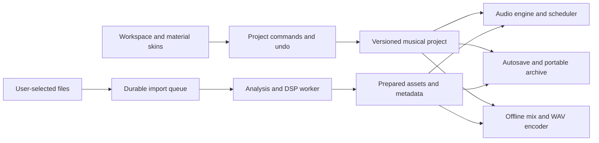

# RaveFold delivery plan

Date: 2026-09-22. Status: researched proposal; application implementation has
not started. [PRODUCT.md](../PRODUCT.md) owns confirmed user requirements.
[Private research notes](research.md) distinguish inspected facts from untested
proposals. All other choices below are recommended defaults, not additional user
approvals. Exact technology names, source links and asset evidence remain in
that ignored local file. Public copies of this plan require access to the
private specification before source-dependent implementation decisions can be
made.

## 1. Product and first release

Make a rave track by finding a sound, hearing it, placing it on a musical grid,
building variations, and exporting the result. Preserve OG's immediate
sample-building workflow while adding reliable undo, searchable sounds,
background import, clear waveforms, and portable projects.

Proposed audience: people who want to compose rave music quickly, including
returning OG users. Start with desktop and laptop browsers, keyboard and mouse.
The first useful outcome is a saved, reopenable, exported arrangement made from
the user's local library.

OG provides the workflow reference for arrangement, sample import, recording and
sound generation. Source descriptions and library measurements are retained in
[private research](research.md#original-product).

| First release                                                                         | Later, after the core passes verification               |
| ------------------------------------------------------------------------------------- | ------------------------------------------------------- |
| Library search, category filters, favorites, preview, waveform and preparation status | Microphone recording and resampling                     |
| Eight initial tracks, add/remove/reorder up to a proposed tested limit of 32          | A new OG-inspired sound synthesizer                     |
| Drag or keyboard insert, move, duplicate, delete, trim and repeat clips; undo/redo    | Automation lanes, richer effects and performance scenes |
| Play, pause, stop, seek, loop region, musical snap and timeline zoom                  | MIDI input and external synchronization                 |
| Track gain, pan, mute, solo, meters; master gain and clipping indication              | Cloud accounts, collaboration and public sample sharing |
| Background preparation of imports, with review and retry                              | Legacy OG project conversion, if separately researched  |
| Autosave, portable project archive, stereo WAV export, all six skins                  | Full mobile editing and note-level mode conversion      |

Do not add a variable project tempo, a key selector, plug-in hosting, or a full
piano-roll editor to this release. The fixed musical context is a product
feature.

## 2. Musical contract

### Confirmed decisions

- The arrangement runs at **180 BPM in C minor**.
- Ready rhythmic samples are **90 or 180 BPM only**.
- Convert **every other source tempo**, including 45, 135 and 270 BPM, before
  use. This clarification replaces the initial multiple-of-45 exception.
- Required stretching and shifting complete in the background before readiness.
- Major and mixed-key imports remain in review. Only compatible sections can be
  used in the first release. A global pitch shift does not change musical mode.

### Proposed precise behavior

Use 4/4 time, integer musical ticks at 960 ticks per quarter note, and a default
one-bar snap. Offer beat and sixteenth-note snap. Derive seconds from absolute
ticks rather than repeatedly adding rounded clip durations.

Keep 90 BPM loops at their natural speed as half-time material. Four source
beats at 90 BPM occupy eight arrangement beats at 180 BPM. An eight-beat 180 BPM
loop occupies eight arrangement beats. Neither needs a speed or pitch change to
fit.

For a rhythmic import, suggest the target in `{90, 180}` that minimizes
`abs(log2(targetBpm / sourceBpm))`; prefer 180 on a tie. Allow the user to
choose the other supported target before processing. Preserve the source beat
count:

- `outputDuration = sourceDuration * sourceBpm / targetBpm`.
- `arrangementBeats = sourceBeats * 180 / targetBpm`.
- Pitch and tempo are independent processing parameters.

| Source                           | Preparation                                               | Placement at 180 BPM        |
| -------------------------------- | --------------------------------------------------------- | --------------------------- |
| 180 BPM, C minor, 4 source beats | Validate; no musical transform                            | 4 arrangement beats         |
| 90 BPM, C minor, 4 source beats  | Validate; keep half-time                                  | 8 arrangement beats         |
| 135 BPM, D minor, 4 source beats | Suggest 180 BPM; shift down 2 semitones                   | 4 arrangement beats         |
| 45 BPM, C minor, 4 source beats  | Suggest 90 BPM                                            | 8 arrangement beats         |
| 270 BPM, C minor, 4 source beats | Suggest 180 BPM                                           | 4 arrangement beats         |
| Major or mixed-key phrase        | Review; isolate a compatible section and analyze it again | Unavailable until validated |

Detection must expose uncertainty, especially 90/180 half-time ambiguity. Do not
claim that a beat detector can infer intent or that a key detector proves every
note is compatible. Store source metadata, measured evidence, confidence, manual
corrections, and prepared values separately.

For minor-key tonal material, transpose to C using the nearest signed semitone
offset; retain a deliberate octave override. Treat C natural minor as the
initial analysis reference, with harmonic/melodic-minor phrases flagged for
musical review. Keep original audio. Never mark a result as C minor simply
because processing ran.

Proposed exception for non-tonal material: drums, noise, and unpitched effects
are key-neutral and need no pitch shift. A rhythmic drum loop still needs a
valid 90/180 tempo. A free one-shot has no measured BPM; assign a 180 BPM
placement context and preserve its transient/duration. Tuned percussion still
needs pitch review. This classification is an open policy choice in section 9.

## 3. Workspace and interaction

Use a stable composition workspace. The arranger is the main surface; the
library and inspector support it. Avoid floating panels that move while editing
clips.

```text
RaveFold | Project / Save / Export | Transport | 180 BPM / C minor | Skin
------------------------------------------------------------------------
Library             | Bar ruler and loop region              | Inspector
Search and filters  | Track headers | Arranger grid          | Clip/sample
Sample rows         |               | Clips and waveforms    | properties
Preview and status  |               | Playhead               | Preparation
------------------------------------------------------------------------
Track mixer and master meter              | Import progress / storage state
```

Keep transport visible. Show sample name, category, source/prepared tempo, key
status, length and readiness in the library. Provide a waveform and detailed
provenance in the inspector. Keep processing internals out of ordinary controls.

Insertion shows a snapped ghost and affected track. Use one active clip per
track in the first release. Reject overlaps with a clear conflict indication;
require an explicit replace action to remove an existing clip. Resizing can
repeat a loop or trim a region through distinct handles/modes. Use short
boundary fades where appropriate, without moving the musical onset or hiding bad
loop markers.

The preview is exclusive: starting another preview stops the previous one. A
ready-loop preview can start on the next bar during playback. Source audition in
the review inspector is separate from the arrangement and does not confer
readiness.

Provide keyboard commands for transport, insertion, movement, duplication,
deletion, undo/redo, and escaping an operation. Controls need visible focus and
accessible labels. Color identifies sound roles, but labels and icons carry the
same meaning. Announce import results without announcing every meter update.

At 1280 x 720, collapse the inspector before shrinking the arranger. At narrower
widths, use library/arranger/mixer views. Phone layouts may browse and preview,
but full touch editing is outside the initial release promise. Verify 200% zoom,
keyboard operation, contrast and focus in every skin.

### Six skins, one set of controls

Use all six presets in the
[private technology specification](research.md#binding-technology-requirements).
They are reference-demo configuration entries, not exported package presets.
Create a typed RaveFold registry from pinned defaults plus each preset patch.
Keep required license notices with copied material. The descriptions below are
neutral references, not replacements for the required preset definitions.

| Skin        | Character                                         |
| ----------- | ------------------------------------------------- |
| Reference 1 | Clear surfaces and an iridescent rim              |
| Reference 2 | Dark frosted surfaces; proposed first-run default |
| Reference 3 | Opaque surfaces and subdued effects               |
| Reference 4 | Clear refractive surfaces                         |
| Reference 5 | Pink edges and a dark energetic palette           |
| Reference 6 | Strong movement and ambient effects               |

Keep layout, semantic sound colors, focus treatment and commands stable across
skins. Put opaque or sufficiently backed text and waveforms above the material.
Remember the selected skin as a user preference, separately from project audio.

Use the material library on approximately five to eight major panels, not
individual clips, rows, meters or waveform segments. Its documented default
surface budget is 16. Scrolling happens inside panels. Keep dialogs semantic DOM
with simple backing unless a second WebGL pass proves affordable.
[Private source evidence](research.md)

Provide Full, Reduced and Static effects settings for all six skins. Static uses
the same tokens with CSS surfaces and does not mount the material renderer.
Reduced-motion preference defaults to Static, with an explicit user override.
The material library's reduced motion still runs animation; `canvas={false}`
only changes canvas placement. Neither is a renderer-off switch. Skin changes
must never recreate the audio engine. [Private source evidence](research.md)

## 4. Technical design

Use the required component framework and material library from the
[private technology specification](research.md#binding-technology-requirements),
with the proposed typed language and build tool recorded there. Pin tested
versions and a lockfile at implementation time. Use public components and hooks;
do not rely on renderer internals. Exact compatibility requirements remain in
private research and must be checked before dependency installation.



| Boundary                 | Responsibility                                                            |
| ------------------------ | ------------------------------------------------------------------------- |
| `domain/`                | Pure project model, ticks, clip edits, command history, schema validation |
| `audio/`                 | Audio graph, absolute-time scheduling, transport, preview, render graph   |
| `import/` and `workers/` | File inspection, analysis, transformation, queue and cancellation         |
| `storage/`               | IndexedDB metadata, OPFS files, recovery, archive import/export           |
| `ui/` and `skins/`       | Component controls, virtualized library/timeline, theme adapter           |
| `catalog/`               | Source manifest, categories, stereo pairs, corrections and provenance     |

Start with Web Audio buffer sources and native gain/pan nodes. Schedule against
`AudioContext.currentTime`, using an initial 25 ms scheduler tick and 200 ms
look-ahead as values to benchmark. UI updates and `requestAnimationFrame` never
trigger note timing. Handle seek, pause, loop wrap and edits by cancelling stale
scheduled voices and rebuilding from the selected musical position. Cap voices
and smooth gain changes. Meter rendering may drop frames; audio must not.

Resume audio from an explicit user gesture. Handle suspended contexts and output
device changes visibly. Propose pausing transport when the page becomes hidden
for the first release, avoiding a promise of uninterrupted background playback.
Record the transport position and require explicit resume. A future AudioWorklet
scheduler must earn its complexity through measured need, not be assumed
necessary for preprocessed sample playback.
[Private source evidence](research.md)

Use a Worker plus a WASM DSP kernel for preparation. Prototype the first
candidate recorded in
[private research](research.md#browser-audio-and-storage-evidence), which
supports independent stretch and pitch processing. Prove a Worker-compatible
offline interface and latency/tail handling before selecting a package or
compiling an adapter. The existence of a web wrapper does not prove it runs
unchanged in a Worker. Retain the applicable license obligations.

Do not substitute `AudioBufferSourceNode.playbackRate` for pitch-preserving time
stretching: it resamples and couples speed to pitch. Standard ready playback is
at rate 1. Prefer a single-threaded WASM build with transferable buffers so the
baseline does not depend on SharedArrayBuffer or special isolation headers.
[Private source evidence](research.md)

## 5. Import and catalog pipeline

Rebuild the supplied library manifest from actual headers and confirmed loop
boundaries. Preserve source metadata unchanged as provenance. Resolve catalog
discrepancies, boundary outliers and stereo pairing before bulk import. Counts,
specific filenames, inspection methods and measured findings remain in
[private research](research.md#supplied-sample-library).

The browser cannot open machine-local folders automatically. Offer user-selected
files and folder import where supported, with multi-file selection and portable
archives as fallbacks. A separate local catalog command may read
`APP_INSTALL_DIR` and `SAMPLES_DIR` from the ignored `.env.local` during
development. Never expose those values in client environment variables, logs,
documentation, manifests, archives or the browser build. Store only relative
paths and source IDs as provenance. Do not copy the whole sample library into
public assets or the repository. Recover display names from the installed
catalog for private local use. Account for catalog gaps and candidate stereo
pairs before declaring the library migration complete; matching filenames alone
do not prove channel alignment. Exact names and findings stay in private
research and local user data.

```text
selected -> queued -> decoding -> analyzing -> transforming -> validating -> ready
                                  |                              |
                                  +-> needs-review <-------------+
Any active phase -> failed or cancelled
Interrupted jobs -> queued on reopen, after checking stored input
```

1. Validate file type, byte size and supported format; hash the original bytes.
   MVP guarantees WAV PCM16/24 and float32, mono/stereo. Other codecs wait for a
   browser-decoder compatibility check. Start with proposed per-file limits of
   five minutes decoded audio and 100 MiB input; report oversized files clearly.
2. Save the immutable original and a durable job record before processing. Parse
   guaranteed WAV formats in the Worker. For optional codecs, use a bounded
   decoder adapter; do not assume `decodeAudioData` is available in a Worker.
3. Analyze BPM, phrase boundaries, tuning, root, mode and tonal/non-tonal class.
   Validate declared metadata first. Select the detector and confidence
   thresholds only after a labeled corpus test; no detector is selected in this
   plan.
4. Ask for source BPM, key or loop markers when confidence is insufficient.
   Known OG provenance supplies a declared 180 BPM/C-minor baseline, not proof
   that every file is a clean loop or individually tonal. Major/mixed-key
   sections stay in review until trimmed to compatible material and reanalyzed.
5. Prepare an approved 90/180 target. Change duration without changing pitch and
   pitch without changing the approved duration. Preserve stereo phase using
   joint channel processing. Remove DSP pre-roll and account for tails
   explicitly.
6. Verify output length, finite samples, valid channels, clipping, boundaries
   and analysis status. Store transformation parameters, algorithm/version,
   output hash and measurements. Readiness requires a complete validated
   derivative.
7. Write the derivative completely before committing its ready metadata. The
   catalog and arranger must never expose partial output. Keep incomplete files
   recoverable or collect them after a safe cleanup pass.

No-transform imports still pass validation. Deduplicate jobs by original
content, selected region, target BPM, pitch settings and processor version. A
changed setting creates a new derivative and cannot overwrite audio used by an
existing project. Recompute derived waveforms and markers when their inputs
change.

Start with one heavy job at a time and prioritize playback resources. Show
phase, progress when measurable, cancel, retry and actionable errors.
Cancellation must stop work and prevent a late result from becoming ready. Chunk
long work so the Worker can process cancellation, or terminate and recreate it
safely.

Here, background means asynchronous work while the browser session can run.
Closing the tab or OS suspension can stop processing. Persist the queue, retain
completed files, and restart interrupted work on reopen. Do not promise that a
service worker will finish an arbitrarily long DSP job after the tab closes.

## 6. Projects, storage and export

Use IndexedDB for searchable metadata, project revisions and jobs; use OPFS for
large originals and prepared files, with a bounded IndexedDB Blob fallback.
Offer storage estimates, handle quota errors and request persistent storage when
appropriate. Browser storage is not a backup; clear-site-data can delete it.
[Private source evidence](research.md), [Private source evidence](research.md)

| Record         | Essential fields                                                                                                           |
| -------------- | -------------------------------------------------------------------------------------------------------------------------- |
| Project        | schema version, stable ID, revision, fixed BPM/key, meter/ticks, tracks, clips, loop region                                |
| Track          | stable ID, order, name, gain, pan, mute, solo                                                                              |
| Clip           | stable ID, track ID, prepared asset ID, start/length ticks, source offset, repeat and fades                                |
| Sample         | content hash, original name, category, declared/detected/corrected metadata, provenance                                    |
| Prepared asset | source region, target tempo/key or neutral class, processor version/settings, hash, frames, channels, loop markers, status |
| Job            | inputs, phase, retry/cancel state, progress, error and completed output references                                         |

Keep musical project state independent of UI components, filenames and skin
selection. Validate loaded documents and provide explicit schema migrations.
Autosave a new valid revision transactionally; keep the last known-good
revision. Use an asset-write/metadata-commit protocol because OPFS and IndexedDB
do not share a transaction. Prevent simultaneous editing by two tabs or open the
second read-only.

Use a proposed `.ravefold` archive containing versioned JSON, checksums and the
referenced prepared audio. Include original source regions/files only through an
explicit option when needed for reprocessing. A JSON-only reference export can
require relinking; distinguish it clearly from a portable project. Validate
archive paths, expansion sizes and checksums before writing imported content.

Keep the full library on disk, not decoded in memory. Decode and cache the
visible preview and current arrangement working set. Use the capacity evidence
in private research, then measure the prototype before choosing fixed cache
limits. Do not load all samples merely to show library rows.

Render stereo WAV through the same graph builder and clip timing rules used for
playback, using `OfflineAudioContext` and a Worker encoder. Propose 44.1 kHz,
16-bit WAV with dither, with explicit range/tail handling and clipping warnings.
Resampling between asset and device rates must preserve seconds and musical
ticks. Do not advertise true-peak limiting without an implementation and
verification. Prototype export memory and cancellation before committing to a
maximum song length.

## 7. Delivery sequence and acceptance gates

Each milestone depends on the preceding gate. These are deliverables, not
elapsed time estimates. Do not build the full workspace before resolving DSP
feasibility.

| Milestone                 | Deliverable                                                                                                                                                                                   | Exit evidence                                                                                                                                                                                                              |
| ------------------------- | --------------------------------------------------------------------------------------------------------------------------------------------------------------------------------------------- | -------------------------------------------------------------------------------------------------------------------------------------------------------------------------------------------------------------------------- |
| M0: Contracts and catalog | Resolve product policies in section 9 and define M1 evaluation criteria; version musical/import/project contracts; generate private asset manifest; confirm stereo pairs and outliers         | Every supplied WAV is accounted for with header-derived timing; uncertain entries remain explicitly unready; no source file changed; corpus coverage/review criteria recorded; measured technical selections remain for M1 |
| M1: Audio and DSP proof   | Minimal headless browser harness, 180 BPM scheduler, 90 half-time playback, detector-corpus trial, Worker stretch/pitch and export prototype; representative material panels with six presets | Correct tempo/duration and pitch on labeled fixtures; repeated loop/seek tests; cancellation/reload recovery; measured concurrent playback/DSP/material UI CPU and memory; listening review and corpus coverage results    |
| M2: Workspace             | Application shell, library, arranger, command undo, accessible editing and six actual presets                                                                                                 | Insert/edit a short arrangement with pointer and keyboard; all six skins retain control behavior and audio continuity; CSS fallback works                                                                                  |
| M3: Full import           | Persistent queue, analysis/review UI, prepared asset cache, pairing and batch ingestion                                                                                                       | 45/90/135/180/270 BPM cases, minor transposition, major/mixed-key hold, corrupt input, stereo, retry and quota cases pass                                                                                                  |
| M4: Save and export       | Autosave/recovery, portable archives, relinking, offline stereo WAV                                                                                                                           | Reopen in a clean browser profile; exact project data and assets survive; export matches arrangement timing and mixer state                                                                                                |
| M5: Release validation    | Production build, static hosting configuration, performance and accessibility validation                                                                                                      | Browser matrix, workload targets, import/playback contention, six-skin checks, recovery and export checks all recorded; remaining limits documented                                                                        |

M1 establishes feasibility before selecting a BPM/key detector, final DSP
package, runtime cache limits or release hardware floor. M2 may reuse that
prototype, but temporary harness code becomes maintained test tooling or is
removed.

Before M1, define a labeled corpus spanning every supplied category, short
one-shots, stereo pairs, the identified timing outliers, and controlled external
imports. Agree the minimum usable preparation coverage and maximum manual-review
burden for each class during M0. M1 must report correct-ready, false-ready,
review and unusable outcomes separately; a high acceptance rate alone cannot
establish quality.

## 8. Verification and release targets

Use the proposed unit-test runner for pure musical calculations, command
history, state transitions, project schemas and migrations. Use headless browser
automation against the production build for integration and visual checks. Keep
private OG material out of public CI: use generated signals and distributable
fixtures there, with a separate local corpus suite for the supplied library.

Proposed desktop release coverage: current and previous stable versions of the
desktop browsers named in the private technology specification. Record exact
versions in private test evidence. The first prototype browser is not the only
claimed supported browser. Automated engine coverage does not replace
verification in each actual release browser. Mark unavailable environments
unverified.

The production baseline is HTTPS static hosting with Worker/WASM assets served
from the app origin. Test a built artifact with correct MIME types, asset paths
and CSP, without a development server or required cross-origin isolation.
Include WebGL2 loss/unavailability, no folder picker, denied persistence,
exhausted quota, interrupted imports, missing assets and suspended audio.

All numbers below are proposed acceptance targets, **not measured results**:

| Check                    | Fixture and target                                                                                                                                                                                |
| ------------------------ | ------------------------------------------------------------------------------------------------------------------------------------------------------------------------------------------------- |
| Musical timing           | Synthetic impulses over 10 minutes, 44.1/48 kHz renders, loop and seek: onset error <=1 output sample against the mathematical schedule; no accumulating drift                                    |
| Transformation           | Known BPM/key signals: length within 1 frame of the selected region target after latency compensation; sustained test-tone pitch within 5 cents; joint stereo alignment retained                  |
| Musical quality          | Local review of bass, kicks, breaks, pads, vocals, FX and split stereo at representative and extreme ratios; record artifacts and reject unusable derivatives                                     |
| Editing load             | 32 tracks, 4,096 clips, 256 bars, complete catalog metadata: selection/drag response p95 <50 ms; no import-caused main-thread task >50 ms                                                         |
| Playback contention      | 32 simultaneous voices plus preview, waveform scrolling, one active conversion and every skin including the most animated reference for 10 minutes: no detected missed onsets or audible dropouts |
| Import accuracy          | Labeled corpus covering 90/180 ambiguity, off-grid recordings, minor/major/mixed/unpitched material; publish errors and review rates before setting readiness thresholds                          |
| Recovery and portability | Kill/reload in each import/save phase; preserve last valid project; no ready partial asset; reopen a portable archive with browser storage cleared                                                |
| Accessibility            | Automated checks plus manual keyboard/focus/zoom review in six skins, Full/Reduced/Static effects and forced-colors where supported                                                               |

Benchmark on a documented machine with integrated graphics and 8 GB RAM as a
candidate floor. Record CPU/GPU, RAM, OS, browser, output device, sample rate,
build, workload and method. Headless timing and screenshots do not establish
real-device listening quality or GPU performance. Choose final limits from
results.

## 9. Decisions to challenge with Grill Me

Settled: product name; required framework/UI library; six source skins; 180
BPM/C minor; only 90/180 ready rhythmic samples; conversion of all other tempos;
major/mixed-key review. Do not reopen those without new evidence or a user
change.

| Decision                                       | Proposed default                                                                                                                        | Owner and next verification                                                                                                 |
| ---------------------------------------------- | --------------------------------------------------------------------------------------------------------------------------------------- | --------------------------------------------------------------------------------------------------------------------------- |
| Non-tonal and one-shot policy                  | Key-neutral percussion/noise; no fake key detection; one-shots get placement context without invented measured BPM                      | Product owner; audition representative FX/drums and approve exceptions before M0 closes                                     |
| C-minor compatibility and detection confidence | Natural-minor analysis reference; harmonic/melodic phrases need review; never silently force a mode                                     | Product owner and audio implementer; label representative phrases and compare analyzer results in M1                        |
| Release scope and browser/hardware floor       | Desktop, eight initial tracks, up to 32; current/previous stable desktop browsers                                                       | Product owner; confirm workflow and use M1 measurements to set supported limits                                             |
| Catalog distribution                           | User imports local assets; public builds use only independently cleared content                                                         | Product owner; inspect applicable terms or obtain permission before distributing any original library files                 |
| DSP and detector selection                     | Prototype the privately documented DSP candidate; select detector after corpus evaluation                                               | Audio implementer; demonstrate Worker integration, latency compensation, quality, performance and dependency license review |
| Corpus success criteria                        | No silent false-ready result in labeled fixtures; set usable-coverage and manual-review limits by class before evaluating the prototype | Product owner and audio implementer; agree the corpus and numerical thresholds in M0, then measure in M1                    |

Invoke [.github/skills/grill-me/SKILL.md](../.github/skills/grill-me/SKILL.md)
for one decision at a time. Record answers here and update PRODUCT.md only for
newly confirmed product requirements. Do not start implementation from the
interview unless the user requests it.

## 10. Current limitations and next action

Only research and planning have been completed. There is no application,
measured DSP benchmark, browser test suite, listening review or approved
distribution permission for the sample library. The original application has not
been launched; the classic-workflow assessment uses the product page and
installed help.

The largest remaining uncertainty is how well imported real recordings can be
classified and transformed without audible damage while playback and the
material UI run together. M1 tests feasibility through a labeled corpus,
repeatable timing tests, listening review and a measured production-build
prototype with representative material panels. M5 repeats the combined workload
against the completed application before claiming release performance.

The next implementation step, once requested, is M0 followed by M1. The next
planning step is the non-tonal/one-shot decision in the imported Grill Me skill.
